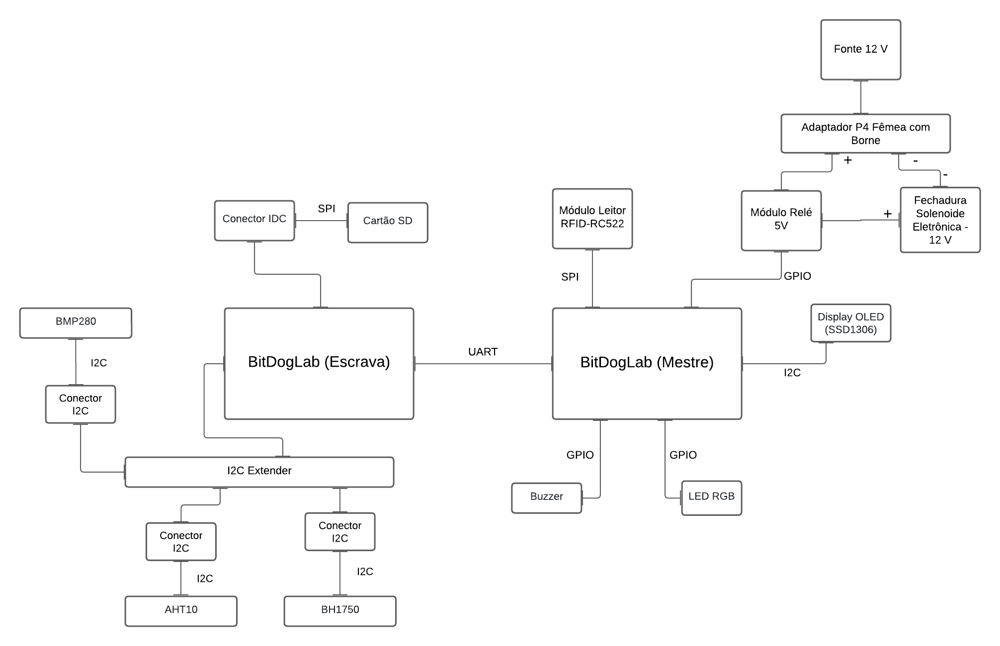

# Projeto Final: Etapa 1 - EmbarcaTech 2025

Autor: **Davi Henrique Vieira Lima e José Augusto Alves de Moraes**

Curso: Residência Tecnológica em Sistemas Embarcados

Instituição: EmbarcaTech - HBr

Brasília, Julho de 2025

---

## **Introdução**

---

## **Arquitetura do Sistema**

---

## **Diagrama de Hardware**
O diagrama a seguir demonstra, de forma simples, o Hardware e suas conexões utlizadas para o projeto:

---

## **Blocos Funcionais**

---

## **Fluxograma do Software**

---

## **Considerações Finais**

---