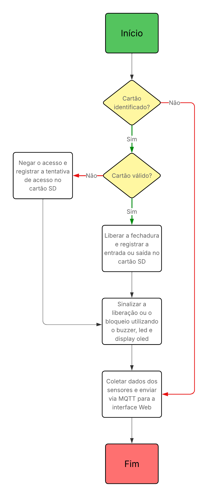

# Projeto Final: Etapa 2 - EmbarcaTech 2025

Autor: **Davi Henrique Vieira Lima e José Augusto Alves de Moraes**

Curso: Residência Tecnológica em Sistemas Embarcados

Instituição: EmbarcaTech - HBr

Brasília, Julho de 2025

---

## **Introdução**

Tendo como base a descrição do sistema definida no [documento da 1° etapa](<../Etapa 1/README.md>)
do projeto final da segunda fase do EmbarcaTech 2025, foram elaborados os seguintes diagramas
descrevendo o sistema que será implementado.
Esta documentação foi feita a fim de guiar e formalizar o desenvolvimento do projeto,
permitindo que o mesmo seja melhor avaliado ou reproduzido por terceiros.

---

## **Arquitetura do Sistema**
A arquitetura do sistema foi desenvolvida com foco na modularidade e na clareza, visando atender de forma eficiente aos requisitos funcionais e não-funcionais do projeto. Para proporcionar uma compreensão completa e integrada, a arquitetura é apresentada sob três perspectivas distintas e complementares: a organização do hardware, a decomposição em blocos funcionais e o fluxo lógico do software.

O **Diagrama de Hardware** detalha os componentes eletrônicos utilizados e suas interconexões físicas, estabelecendo a base material do sistema. Já o **Diagrama de Blocos Funcionais** abstrai o hardware para uma visão lógica, dividindo o sistema em módulos com responsabilidades específicas, como captura de imagem, interface com o usuário e conectividade. Por fim, o **Fluxograma de Software** ilustra a sequência de operações e as decisões que governam o comportamento do sistema, desde a inicialização até o fim da operação.

---

## **Diagrama de Hardware**
O sistema embarcado proposto possui uma **arquitetura de hardware centrada na BitDogLab**, responsável por integrar e controlar todos os periféricos necessários ao funcionamento do projeto. 

A entrada principal do sistema é feita por meio de um **Teclado Matricial 4x4**, conectado ao BitDogLab através de um conector IDC. Esse teclado permite que o usuário interaja diretamente com o sistema, inserindo comandos como a operação desejada e a quantidade correspondente.

A **Câmera OV2640**, ligada ao BitDogLab via Conexão BDL, é responsável pela captura de imagens e leitura de QR Codes. Essa conexão foi escolhida por sua compatibilidade com o módulo BitDogLab, garantindo um encaixe seguro e confiável.

Para armazenamento local dos dados, o sistema conta com um **Cartão SD** conectado ao BitDogLab utilizando o protocolo SPI. Isso permite registrar as informações do estoque de forma persistente, possibilitando o funcionamento offline do sistema.

A interface com o usuário também é composta por um **Display OLED (SSD1306)**, que se comunica com o BitDogLab via I2C. Esse display exibe informações úteis ao usuário, como o conteúdo do QR Code lido, instruções de operação, confirmações e mensagens de erro.

Para fornecer feedback adicional ao usuário, o sistema utiliza dois dispositivos conectados via GPIO: um **LED RGB**, que indica estados do sistema através de diferentes cores, e um **Buzzer**, que emite sinais sonoros de aviso ou confirmação.

Essa organização do hardware garante modularidade e eficiência na comunicação entre os componentes, otimizando o desempenho do sistema embarcado e assegurando que ele atenda de forma confiável às suas funções principais.

O diagrama apresentado ilustra de maneira clara as conexões entre os componentes físicos, bem como os protocolos de comunicação utilizados:

---

## **Blocos Funcionais**
Como foi mencionado anteriormente, sistema foi projetada de forma modular para garantir clareza, escalabilidade e manutenibilidade. Dessa forma, cada bloco funcional é responsável por uma tarefa específica, e todos são orquestrados por uma unidade central de processamento.
A seguir é explicado a funcionalidade de cada bloco:
* **Módulo de Captura de Imagem**: representado pela Câmera OV2640, esse módulo é responsável pela identificação de produtos através da leitura e decodificação de QR Codes.
* **Módulo de Interface com Usuário**: permite a interação direta do usuário com o sistema. Por meio dele, é possível especificar a operação desejada (adição ou retirada) e a quantidade de produtos. Ele é representado pelo teclado matricial e o display OLED.
* **Módulo de Processamento**: responsável por executar a lógica de controle principal. Ele processa os dados recebidos dos módulos de entrada, gerencia o banco de dados local, controla os módulos de saída para fornecer feedback ao usuário e gerencia a comunicação com o sistema externo.
* **Módulo de Feedback**: consiste na interface de saída de informações detalhadas para o usuário, exibindo e indicando dados do produto, instruções de operação, confirmações, mensagens de erro e o resumo das transações. O display OLED, o LED RGB e o Buzzer representam esse módulo.
* **Módulo de Armazenamento**: responsável por guardar os dados de estoque em um cartão SD, garantindo funcionamento offline e persistência.
* **Módulo de Conectividade**: utiliza o Wi-Fi para conectar-se a um servidor ou sistema central, enviando e recebendo dados via MQTT.

A imagem a seguir explicita de forma visual os blocos funcionais do projeto:

---

## **Fluxograma do Software**

O diagrama a seguir demonstra o fluxo de processos realizados pelo sistema,
mostrando uma abstração do que será implementado em software:

---

## **Considerações Finais**
Portanto, é evidente que foi apresentada uma arquitetura técnica do sistema de controle de estoque, estabelecendo um plano de implementação claro e robusto. A estrutura modular, detalhada através do diagrama de hardware, dos blocos funcionais e do fluxograma de software, foi projetada para atender a todos os requisitos, garantindo escalabilidade e manutenibilidade.

O projeto se mostra tecnicamente viável e com grande potencial para otimizar a gestão de inventários/estoques, oferecendo um caminho bem definido para o desenvolvimento de uma ferramenta eficiente e alinhada às necessidades do mercado.

