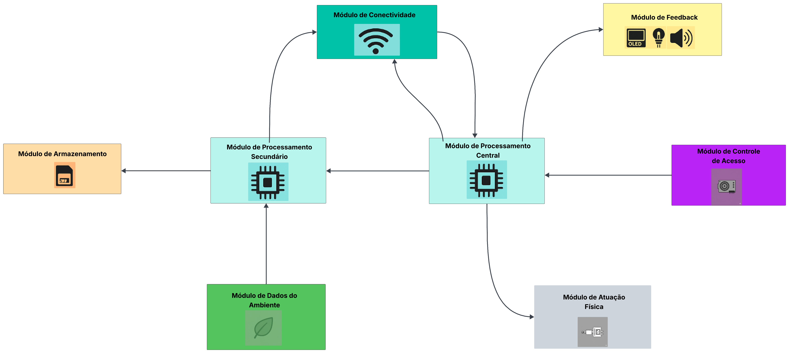

# Projeto Final: Etapa 2 - EmbarcaTech 2025

Autor: **Davi Henrique Vieira Lima e José Augusto Alves de Moraes**

Curso: Residência Tecnológica em Sistemas Embarcados

Instituição: EmbarcaTech - HBr

Brasília, agosto de 2025

---

## **Introdução**

Tendo como base a descrição do sistema definida no [documento da 1° etapa](<../Etapa 1/README.md>)
do projeto final da segunda fase do EmbarcaTech 2025, foram elaborados os diagramas a seguir, os quais descrevem de forma detalhada a estrutura e o funcionamento do sistema que será implementado, especificando a arquitetura do sistema.

Esta documentação tem como objetivo guiar, formalizar e padronizar o desenvolvimento do projeto, permitindo uma avaliação mais precisa, bem como a reprodutibilidade por terceiros interessados.

---

## **Arquitetura do Sistema**
A arquitetura do sistema foi desenvolvida com foco na modularidade e na clareza, visando atender de forma eficiente aos requisitos funcionais e não-funcionais do projeto. Para proporcionar uma compreensão completa e integrada, a arquitetura é apresentada sob três perspectivas distintas e complementares: a organização do hardware, a decomposição em blocos funcionais e o fluxo lógico do software.

O **Diagrama de Hardware** detalha os componentes eletrônicos utilizados e suas interconexões físicas, estabelecendo a base material do sistema. Já o **Diagrama de Blocos Funcionais** abstrai o hardware para uma visão lógica, dividindo o sistema em módulos com responsabilidades específicas, como captura de imagem, interface com o usuário e conectividade. Por fim, o **Fluxograma de Software** ilustra a sequência de operações e as decisões que governam o comportamento do sistema, desde a inicialização até o fim da operação.

---

## **Diagrama de Hardware**
O sistema embarcado apresentado adota uma **arquitetura distribuída**, composta por dois módulos BitDogLab que operam em conjunto na configuração mestre-escravo, interligados por meio do protocolo I2C. Essa abordagem proporciona maior modularidade, divisão de tarefas e escalabilidade ao projeto.

Uma das principais entradas do sistema é realizada por um **Teclado Matricial 4x4**, conectado ao **módulo BitDogLab (Escravo)** via GPIO, utilizando um conector IDC. Esse teclado permite a interação direta do usuário com o sistema, possibilitando a inserção da operação desejada e a quantidade de itens.

A **Câmera OV2640** é conectada também ao **módulo BitDogLab (Escravo)** por meio de uma interface paralela de 8 bits, utilizando um conector IDC via cabo jumper fêmea-macho. Essa câmera é responsável pela captura de imagens e pela leitura de QR Codes, etapa essencial para a identificação dos produtos no sistema.

Todos os dados capturados pelo módulo escravo são enviados para o **módulo BitDogLab (Mestre)** através do barramento I2C. Esse módulo centraliza as decisões e coordena os demais periféricos do sistema.

Para o armazenamento dos dados, a **BitDogLab (Mestre)** utiliza um **Cartão SD**, conectado via protocolo SPI por meio de um conector IDC. Isso possibilita o registro persistente das informações processadas, assegurando a operação offline e a integridade dos dados do sistema.

A comunicação com o usuário também é realizada por meio de um **Display OLED (SSD1306)**, conectado ao módulo mestre via I2C. Esse display exibe informações relevantes, como instruções, mensagens de erro, status do sistema e o conteúdo lido pelos QR Codes.

Além disso, a **BitDogLab (Mestre)** controla dois dispositivos conectados via GPIO para fornecer feedback visual e sonoro ao usuário: um **LED RGB**, utilizado para indicar os estados do sistema através de diferentes cores, e um **Buzzer**, responsável por emitir sinais sonoros para alertas ou confirmações de operação.

Essa organização do hardware garante modularidade e eficiência na comunicação entre os componentes, otimizando o desempenho do sistema embarcado e assegurando que ele atenda de forma confiável às suas funções principais.

O diagrama apresentado ilustra de maneira clara as conexões entre os componentes físicos, bem como os protocolos de comunicação utilizados:

---

## **Blocos Funcionais**
Como foi mencionado anteriormente, sistema foi projetada de forma modular para garantir clareza, escalabilidade e manutenibilidade. Dessa forma, cada bloco funcional possui uma responsabilidade específica no fluxo de operação do sistema, sendo coordenado por uma arquitetura de processamento distribuída entre dois microcontroladores. Essa divisão permite melhor desempenho e paralelismo nas tarefas.

A seguir é explicado a funcionalidade de cada bloco:
* **Módulo de Captura de Imagem**: composto pela câmera OV2640, este módulo é responsável por capturar imagens e realizar a leitura de QR Codes. Os dados capturados são enviados ao módulo de processamento secundário para pré-processamento e repasse.
* **Módulo de Interface com Usuário**: inclui o teclado matricial 4x4, utilizado para a entrada de comandos manuais por parte do usuário, informando ações como entrada ou saída de produto e suas respectivas quantidades.
* **Módulo de Processamento Secundário**: este bloco representa o microcontrolador BitDogLab configurado como escravo. Ele é responsável por adquirir os dados da câmera e do teclado e repassar essas informações, de forma estruturada, ao microcontrolador mestre. Atua como um módulo de coleta e pré-processamento de dados.
* **Módulo de Processamento Central**: neste bloco está o segundo microcontrolador BitDogLab, configurado como mestre. Ele é responsável por coordenar todo o sistema, processando as informações recebidas do módulo escravo, gerenciando o armazenamento local, enviando comandos para os periféricos de feedback e garantindo a comunicação com sistemas externos, representando, assim, o núcleo do sistema.
* **Módulo de Feedback**: consiste na interface de saída de informações detalhadas para o usuário, exibindo e indicando dados do produto, instruções de operação, confirmações, mensagens de erro e o resumo das transações. O display OLED, o LED RGB e o Buzzer representam esse módulo.
* **Módulo de Armazenamento**: responsável por guardar os dados de estoque em um cartão SD, garantindo funcionamento offline e persistência.
* **Módulo de Conectividade**: utiliza o Wi-Fi para conectar-se a um servidor ou sistema central, enviando e recebendo dados via MQTT.

A imagem a seguir explicita de forma visual os blocos funcionais do projeto:

---

## **Fluxograma do Software**

O diagrama a seguir demonstra o fluxo de processos realizados pelo sistema, mostrando uma
abstração do que será implementado em software. No geral haverão dois tipos de processos
executados pelo sistema, processos com input do usuário representados por retângulos azuis
e processos sem input do usuário representados por retângulos brancos. Durante a execução dos
processos com input do usuário a placa mestre manda uma mensagem para a placa escrava e recebe
os dados coletados, essas comunicações foram suprimidas do fluxograma para deixá-lo mais enxuto.

---

## **Considerações Finais**
Portanto, é evidente que foi apresentada uma arquitetura técnica do sistema de controle de estoque, estabelecendo um plano de implementação claro e robusto. A estrutura modular, detalhada através do diagrama de hardware, dos blocos funcionais e do fluxograma de software, foi projetada para atender a todos os requisitos, garantindo escalabilidade e manutenibilidade.

O projeto se mostra tecnicamente viável e com grande potencial para otimizar a gestão de inventários/estoques, oferecendo um caminho bem definido para o desenvolvimento de uma ferramenta eficiente e alinhada às necessidades do mercado.

