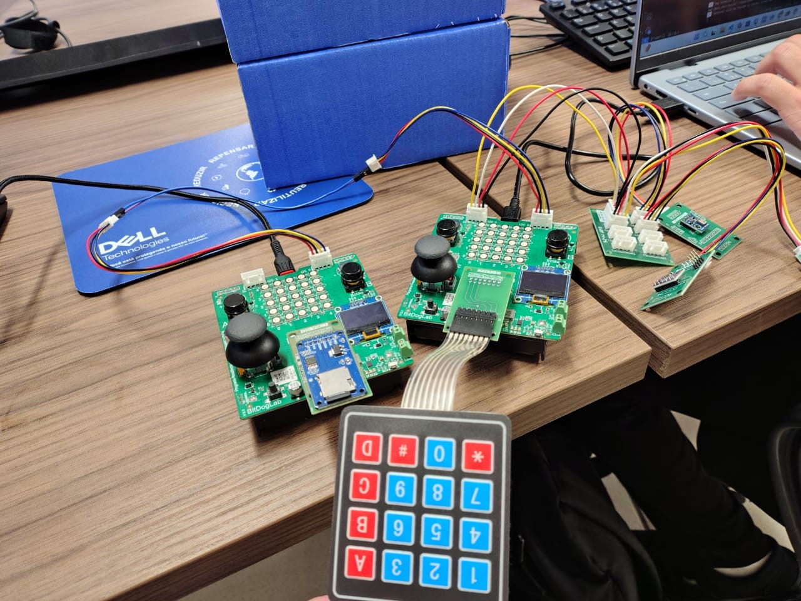
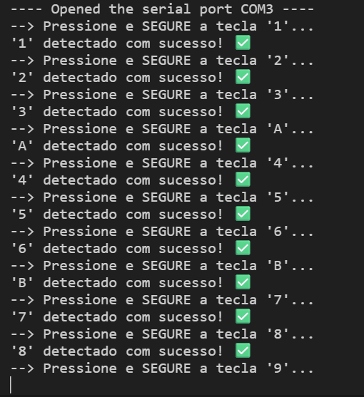
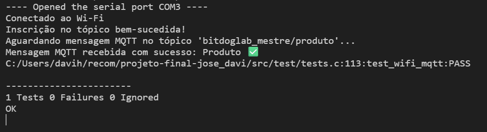
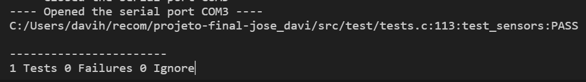

# Projeto Final: Etapa 3 - EmbarcaTech 2025

Autor: **Davi Henrique Vieira Lima e José Augusto Alves de Moraes**

Curso: Residência Tecnológica em Sistemas Embarcados

Instituição: EmbarcaTech - HBr

Brasília, agosto de 2025

---

## **Introdução**
Tendo como base as descrições do sistema definida no [documento da 1° etapa](<../Etapa 1/README.md>) e no [documento da 2° etapa](<../Etapa 2/README.md>) do projeto final da segunda fase do EmbarcaTech 2025, foi elaborado o presente arquivo. O conteúdo aqui reunido tem como propósito detalhar o protótipo funcional atualmente desenvolvido, o qual, embora já represente de forma consistente a proposta inicial, ainda demanda ajustes e refinamentos para alcançar a versão idealizada no planejamento do projeto. 

Esta documentação busca fornecer uma visão abrangente sobre o estado atual do protótipo. Para isso, apresenta registros em fotografias da montagem física, bem como os resultados obtidos nos testes práticos realizados até o momento. Além disso, são descritos os principais desafios encontrados durante o processo de desenvolvimento, destacando tanto questões técnicas quanto de integração entre os diferentes módulos.

Por fim, o documento inclui uma listagem dos ajustes pendentes e das melhorias previstas, que servirão de base para a evolução do projeto rumo à sua versão final. Dessa forma, pretende-se não apenas registrar o estágio atual, mas também orientar os próximos passos necessários para consolidar o sistema conforme os objetivos estabelecidos.

---

## **Fotos da Montagem**
As imagens a seguir registram a montagem do protótipo, ilustrando a integração física dos componentes que formam o sistema. Esta etapa foi fundamental para validar a arquitetura proposta e realizar os testes práticos descritos neste documento.

Ao centro, destacam-se as **duas placas BitDogLab**, que atuam como as unidades de processamento centrais. Conforme detalhado nas entregas anteriores, uma placa foi configurada como mestre, responsável por gerenciar as entradas do usuário e a lógica principal, enquanto a outra atua como escrava, dedicada ao gerenciamento de dados, como o armazenamento em memória externa. A comunicação entre ambas é realizada via protocolo I2C, uma das integrações mais importantes do projeto.

No protótipo, podemos observar os seguintes periféricos conectados:

* O **teclado matricial**, posicionado à frente, é o principal meio de interação do usuário para entrada de dados, como códigos e quantidades de produtos.

* O módulo de **cartão SD**, acoplado à placa escrava, serve como unidade de armazenamento persistente para o inventário.

* Os diversos fios e módulos menores à direita representam a conexão com os **sensores de ambiente** (temperatura, umidade, pressão e luminosidade), responsáveis por coletar dados contextuais.

Esta montagem representa a materialização do sistema, permitindo a depuração do firmware embarcado e a verificação do funcionamento conjunto de hardware e software, passo crucial para a evolução rumo à versão final do projeto.

---

## **Testes**
Utilizando Unity, framework de testes unitários amplamente utilizado em sistemas embarcados e C em geral em razão de ser leve, simples e portável, foram elaborados os seguintes testes:
* **Teste de Verificação de Funcionamento do Teclado Matricial**: o teclado matricial será utilizado para receber as entradas do usuário relacionadas a quantidade do produto e operação desejada (Cadastro ou Retirada). Portanto, diante dessa funcionalidade essencial, foi elaborado um teste interativo, pelo terminal, que verifica o pressionamento de todo botão e informa sucesso ou fracasso ao usuário.

A imagem a seguir demonstra o funcionamento do teste no terminal:

* **Teste da Conectividade Wi-Fi**: o mecanismo de conectividade Wi-Fi utilizando o protocolo MQTT se demonstra como um essencial pilar do projeto em decorrência de sua utilização para envio e recebimento do produto a ser registrado pelo usuário. Para garantir a robustez dessa comunicação, foi elaborado o seguinte teste de integração de ponta a ponta que simula o fluxo completo de recebimento de um comando:
    1. **Conexão à Rede Wi-Fi**: primeiramente, o teste verifica a capacidade do dispositivo de se conectar à rede local utilizando as credenciais fornecidas (SSID e senha).
    2. **Conexão e Autenticação ao Broker MQTT**: uma vez conectado à rede, o dispositivo estabelece a conexão com o broker MQTT, utilizando o IP, ID de cliente e credenciais de segurança.
    3. **Inscrição em Tópico (Subscribe)**: após a conexão com o broker, o sistema se inscreve no tópico `bitdoglab_mestre/produto`, preparando-se para receber mensagens.
    4. **Recebimento e Validação da Mensagem**: a etapa final consiste em verificar se o dispositivo recebe corretamente a mensagem publicada ("Produto") externamente no tópico subscrito.

A imagem a seguir demonstra o funcionamento do teste no terminal:

* **Teste dos Sensores do Ambiente**: a parte de sensoriamento do projeto agrupa o uso de três sensores para a captura dos seguintes dados do ambiente: temperatura, pressão, luminosidade e umidade. Portanto, é necessário verificar se os dados estão sendo capturados e se são de fatos confiáveis. Diante disso, foi elaborado um teste que verifica se os dados retornados pelos sensores estão em valores compatíveis com o ambiente de teste. Foi verificado que as leituras estão na faixa:
    - **0°C a 50°C** para Temperatura
    - **87.5 kPa a 107.5 kPa** para Pressão Atmosférica
    - **Acima de 0 lux** para Luminosidade
    - **5% a 95%** de Umidade Relativa

A imagem a seguir demonstra o funcionamento do teste no terminal:

**Observação**: para mais detalhes acerca da implementação desses testes com a biblioteca *Unity*, confira a pasta `src/test`

---

## **Desafios Encontrados**
Entre os maiores desafios encontrados, destacam-se:
* **Limitação de Pinos Disponíveis**: devido ao grande número de componentes utilizados e o limitado número de pinos disponíveis da BitDogLab, foram necessárias constantes refatorações na implementação e arquitetura do sistema a fim de cumprir os requisitos do projeto.
* **Integração com duas BitDogLabs**: O protocolo I2C, por si só, gerencia o endereçamento e a transmissão de bytes no barramento, mas não define uma estrutura para a troca de mensagens complexas. Dessa forma, para utilizar a comunicação I2C entre as duas BitDogLabs, foi necessários projetar, implementar e depurar um protocolo de aplicação customizado sobre o I2C. Além disso, foi necessário distribuir as responsabilidades entre as BitDogLabs, o que exigiu o desenvolvimento de dois firmwares distintos.
* **Gerenciamento de uma Complexa Estrutura de Pastas**: em razão do grande número de componentes e dependências, foi necessário gerenciar uma complexa estrutura de pastas para que o sistema funcionasse de forma correta.

---

## **Melhorias Planejadas**
Entre as melhorias planejadas para a entrega da versão final, destacam-se:
* **Aprimoramento da Interface de Usuário**: para tornar a interação com o sistema mais intuitiva e responsiva, planeja-se o uso do do módulo buzzer, LED RGB e display OLED. Estes componentes fornecerão feedbacks sonoros e visuais ao usuário, indicando o status da operação (ex: sucesso e erro) e confirmando ações, como o pressionamento de teclas, satisfazendo a proposta inicial do projeto..
* **Mecanismos de Seguração**: além da autenticação, já implementada para combater ataques de *spoofing*, planeja-se implementar mecanismos para combater *sniffing* e *replay* com o uso de criptografia de transporte e timestamps, respectivamente.
* **Elaboração de Mais Testes**: para garantir o funcionamento robusto do sistema, planeja-se o desenvolvimento de mais testes com o framework *Unity*, especialmente relacionados à comunicação I2C entre as BitDogLabs e à interface de usuário.
* **Melhor Organização da Estrutura de Pastas**: a fim de permitir a facilidade de uso do projeto por outros usuários e expansão de suas funcionalidade, é necessária uma melhor organização da estrutura de pastas, focando, assim, em modularidade.
* **Expandir o uso da conectividade Wi-Fi com o protocolo MQTT**: para ampliar a utilidade do projeto e sua área de aplicações, extender o uso do mecanismo de conectividade é essencial. Um exemplo disso seria o uso dessa conectividade para enviar dados que estão armazenados no cartão SD.

---
