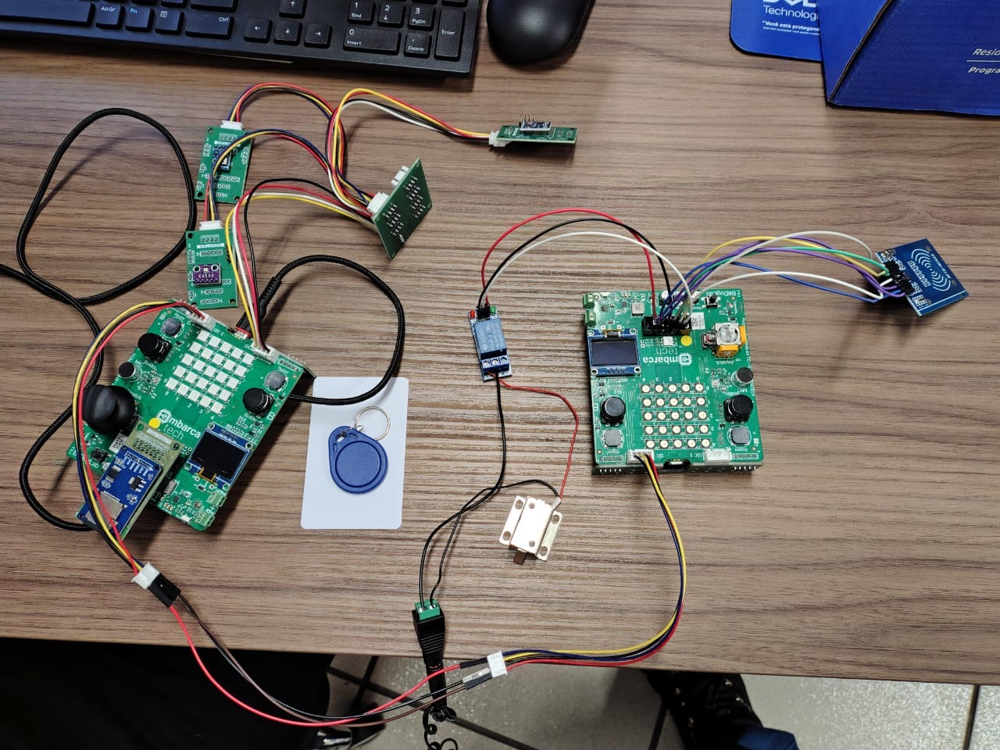

# Projeto Final: Etapa 3 - EmbarcaTech 2025 - **Sistema Inteligente para Ambientes Sensíveis/Críticos**

Autor: **Davi Henrique Vieira Lima e José Augusto Alves de Moraes**

Curso: Residência Tecnológica em Sistemas Embarcados

Instituição: EmbarcaTech - HBr

Brasília, agosto de 2025

---

### *Uma Solução Integrada de Controle de Acesso Físico com Registro de Auditoria e Sensores Ambientais*

---

## **Introdução**
Tendo como base as descrições do sistema definida no [documento da 1° etapa](<../Etapa 1/README.md>) e no [documento da 2° etapa](<../Etapa 2/README.md>) do projeto final da segunda fase do EmbarcaTech 2025, foi elaborado o presente arquivo. O conteúdo aqui reunido tem como propósito detalhar o protótipo funcional atualmente desenvolvido, o qual, embora já represente de forma consistente a proposta inicial, ainda demanda ajustes e refinamentos para alcançar a versão idealizada no planejamento do projeto. 

Esta documentação busca fornecer uma visão abrangente sobre o estado atual do protótipo. Para isso, apresenta registros em fotografias da montagem física, bem como os resultados obtidos nos testes práticos realizados até o momento. Além disso, são descritos os principais desafios encontrados durante o processo de desenvolvimento, destacando tanto questões técnicas quanto de integração entre os diferentes módulos.

Por fim, o documento inclui uma listagem dos ajustes pendentes e das melhorias previstas, que servirão de base para a evolução do projeto rumo à sua versão final. Dessa forma, pretende-se não apenas registrar o estágio atual, mas também orientar os próximos passos necessários para consolidar o sistema conforme os objetivos estabelecidos.

---

## **Fotos da Montagem**
A imagem a seguir registra a montagem final do protótipo, ilustrando a integração física de todos os componentes que formam o sistema de controle de acesso e monitoramento ambiental. Esta etapa foi fundamental para validar a arquitetura proposta e realizar os testes práticos descritos neste documento.

Ao centro, destacam-se as **duas placas BitDogLab**, que constituem a arquitetura de processamento distribuída do sistema. Conforme a arquitetura proposta, uma placa foi nomeada como **Mestre**, à direita, responsável por gerenciar a autenticação de usuários e a interface de feedback, enquanto a outra foi nomeada como **Escrava**, à esquerda, dedicada ao monitoramento das condições ambientais e ao armazenamento dos registros de acesso. A comunicação entre ambas é realizada via protocolo **UART**, uma das integrações mais importantes do projeto.

No protótipo, à direita, ligados à BitDogLab Mestre, podemos observar os seguintes periféricos conectados:

* O **Módulo Leitor RFID-RC522** é o principal meio de autenticação do usuário, permitindo a leitura dos cartões de acesso.

* O **Display OLED**, o **LED RGB** e o **Buzzer** compõem o sistema de feedback, fornecendo ao usuário informações visuais e sonoras sobre o status da sua tentativa de acesso.

* A **Fechadura Solenoide** e o **Módulo Relé** são os atuadores que materializam o controle de acesso físico, permitindo ou negando a abertura da porta conforme a autorização.

Já à esquerda, ligados à BitDogLab Escravo, podemos observar os seguintes periféricos conectados:
* O **módulo de Cartão SD**, acoplado à placa Escrava, serve como unidade de armazenamento persistente para o registro de auditoria, gravando cada evento de acesso com data e hora.

* O **conjunto de sensores ambientais (BMP280, AHT10 e BH1750)** é responsável por coletar continuamente os dados de temperatura, umidade, pressão e luminosidade para garantir a integridade do ambiente.

Como um detalhe extra, à direita da BitDogLab Escravo, podemos ver duas tags RFID, utilizadas nos testes do sistema.

Esta montagem representa a materialização do sistema, permitindo a depuração do firmware embarcado e a verificação do funcionamento conjunto de hardware e software, passo crucial para validar a eficácia da solução integrada de segurança, auditoria e monitoramento ambiental.

---

## **Testes**
Utilizando Unity, framework de testes unitários amplamente utilizado em sistemas embarcados e C em geral em razão de ser leve, simples e portável, foram elaborados um conjunto de testes para verificar o funcionamento individual de cada periférico e protocolo do sistema. A abordagem de testes unitários permitiu validar cada componente de hardware e software de forma isolada, garantindo sua correta operação antes da integração final. Os testes desenvolvidos estão descritos a seguir:

* **Teste de Conectividade Wi-Fi e MQTT (`test_wifi_mqtt`)**: este teste avalia a capacidade do sistema de se conectar à rede Wi-Fi e interagir com um broker MQTT. Nele, o sistema conecta a uma rede Wi-Fi, se inscreve em um tópico MQTT de teste e publica uma mensagem pré-determinada nesse mesmo tópico. O teste passa se a mensagem recebida for idêntica à enviada, validando todo o ciclo de comunicação.

* **Teste dos Sensores do Ambiente (`test_sensors`)**: a parte de sensoriamento do projeto agrupa o uso de três sensores para a captura dos seguintes dados do ambiente: temperatura, pressão, luminosidade e umidade. Portanto, é necessário verificar se os dados estão sendo capturados e se são de fatos confiáveis. Diante disso, foi elaborado um teste que verifica se os dados retornados pelos sensores estão em valores compatíveis com o ambiente de teste. Foi verificado que as leituras estão na faixa:
    - **0°C a 50°C** para Temperatura
    - **87.5 kPa a 107.5 kPa** para Pressão Atmosférica
    - **Acima de 0 lux** para Luminosidade
    - **5% a 95%** de Umidade Relativa

* **Teste de Sincronização de Tempo via NTP (`test_ntp`)**: nessa etapa, há a verificação se o microcontrolador consegue sincronizar corretamente seu RTC (Real-Time Clock) a partir da comunicação com um servidor NTP. Após a requisição e processamento, o teste solicita o timestamp atual e valida se a string retornada é diferente de "RTC nao sincronizado", confirmando que a sincronização de rede e o ajuste do Relógio de Tempo Real (RTC) foram bem-sucedidos.

* **Teste de Comunicação UART (`test_uart`):** esse teste valida a comunicação serial entre as placas Mestre e Escrava, o que é essencial para o registro do acesso de usuários. Ele coloca o sistema em modo de escuta e aguarda o recebimento de uma estrutura de log (`AccessLog`) pela porta UART. O teste é concluído com sucesso ao receber e processar um pacote de dados válido, confirmando que o protocolo de comunicação customizado está funcional.

* **Teste de Leitura RFID (`test_rfid`):** esse teste é responsável por validar todo o fluxo de leitura e decodificação de um cartão RFID a partir de dados, já conhecidos, em uma tag RFID. O teste exige a aproximação de um cartão pré-gravado e então executa os seguintes passos: detecção, leitura do UID (Identificador Único da Tag), autenticação dos blocos de memória e leitura completa do payload. Por fim, ele utiliza as asserções do Unity para verificar se o Nome e o CPF extraídos do cartão correspondem exatamente aos valores esperados, o que confirma a confiabilidade da tecnologia RFID no controle de acesso.

* **Teste de Acionamento da Fechadura (`test_fechadura`):** consiste em um teste simples e direto para verificar o controle do pino GPIO responsável por acionar o relé da fechadura eletrônica. Ele ativa o pino por 3 segundos e depois o desativa, permitindo a verificação visual do correto funcionamento do circuito da fechadura.

**Observação**: para mais detalhes acerca da implementação desses testes com a biblioteca *Unity*, confira a pasta `src/test`

Com o funcionamento adequado de todos esses testes, foram realizados **testes de integração** para avaliar o comportamento do sistema completo, unindo todas as funcionalidades em seus respectivos firmwares (Mestre e Escravo).

Os principais pontos validados foram:
* **Fluxo de autenticação de usuários**: a apresentação de uma tag RFID válida no módulo Mestre resultou no envio do log de acesso via UART ao módulo Escravo, que então registrou o evento com data/hora sincronizada via NTP.
* **Controle físico da fechadura**: após a validação da tag RFID, o comando de abertura foi enviado e a fechadura respondeu de forma confiável.
* **Monitoramento ambiental**: os dados dos sensores coletados pelo Escravo foram publicados periodicamente no broker MQTT, comprovando o envio contínuo e confiável de informações ambientais.

Esses testes demonstraram que o sistema funciona de maneira coesa, sincronizada e resiliente, integrando hardware e protocolos de comunicação para atender aos requisitos do projeto.

---

## **Desafios Encontrados**
Entre os maiores desafios encontrados, destacam-se:
* **Limitação de Pinos Disponíveis**: devido ao grande número de componentes utilizados e o limitado número de pinos disponíveis da BitDogLab, foram necessárias constantes refatorações na implementação e arquitetura do sistema a fim de cumprir os requisitos do projeto.
* **Integração com duas BitDogLabs**: para utilizar a comunicação UART entre as duas BitDogLabs, foi necessários projetar, implementar e depurar um protocolo de aplicação customizado sobre o UART. Além disso, foi necessário distribuir as responsabilidades entre as BitDogLabs, o que exigiu o desenvolvimento de dois firmwares distintos.
* **Gerenciamento de uma Complexa Estrutura de Pastas**: em razão do grande número de componentes e dependências, foi necessário gerenciar uma complexa estrutura de pastas para que o sistema funcionasse de forma correta.
* **Integração do Circuito de Acionamento da Fechadura:**: a integração da fechadura solenoide representou um desafio técnico particular, pois sua operação em 12V exigiu a implementação de um circuito de acionamento com um módulo relé e uma fonte de alimentação externa, adicionando uma camada de complexidade à montagem do hardware.

---

## **Melhorias Planejadas**
Entre as melhorias planejadas para a entrega da versão final, destacam-se:
* **Elaboração de Mais Testes**: para garantir o funcionamento robusto do sistema, planeja-se o desenvolvimento de mais testes com o framework *Unity*.
* **Melhor Organização da Estrutura de Pastas**: a fim de permitir a facilidade de uso do projeto por outros usuários e expansão de suas funcionalidade, é necessária uma melhor organização da estrutura de pastas, focando, assim, em modularidade.
* **Adição de Outros Sensores**: Expandir a capacidade de monitoramento com a adição de outros sensores, como detectores de fumaça, sensores de gás (CO, GLP) ou de movimento (PIR), transformando o sistema em uma central de segurança ambiental ainda mais completa.
* **Integração com Câmeras de Segurança**: Configurar o sistema para, a cada evento de acesso (autorizado ou negado), enviar um comando para uma câmera IP próxima tirar uma foto ou gravar um pequeno clipe de vídeo. A captura de imagem seria então associada ao registro de log, enriquecendo a auditoria.

---
