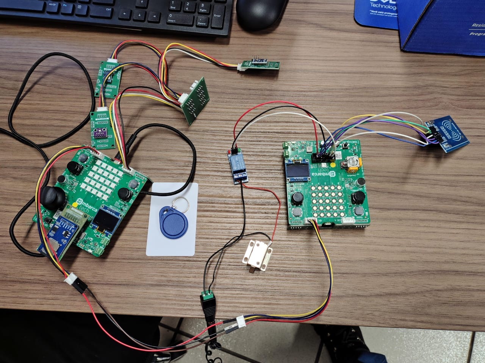

# Projeto Final: Sistema de Sensoriamento e Controle de Acesso a Ambientes - EmbarcaTech 2025

Autor: **Davi Henrique Vieira Lima e José Augusto Alves de Moraes**

Curso: Residência Tecnológica em Sistemas Embarcados

Instituição: EmbarcaTech - HBr

Brasília, setembro de 2025

---
## Descrição do Problema

A gestão de ambientes sensíveis/críticos — como salas de servidores, laboratórios, almoxarifados de alto valor, acervos históricos, entre outros — depende de um controle rigoroso sobre quem acessa o local e das condições em que ele opera. No entanto, as abordagens tradicionais para essa gestão apresentam falhas críticas em três áreas: controle de acesso, auditoria e monitoramento ambiental.

No **controle de acesso**, muitas vezes não há autenticação robusta e integrada, permitindo brechas de segurança. Um grande exemplo desse problema são os roubos de medicamentos controlados, como opioides e vacinas caras, constituindo um problema crônico em hospitais. Muitas vezes, o acesso às farmácias internas é feito com chaves convencionais ou senhas compartilhadas, impossibilitando a identificação do responsável que acessou a área.

Na **auditoria**, a ausência de registros confiáveis e com marcação temporal precisa compromete a rastreabilidade das ações dos usuários. Em casos de acidentes, roubos, entre outros, ter um histórico confiável do acesso dos inidivíduos ao ambiente é essencial para investigações. Frequentemente, em acidentes laborais, a perícia não consegue determinar se o acidente foi causado por erro operacional, falha de manutenção ou sabotagem. Se o acesso à área do acidente fosse registrado, a auditoria mostraria a identidade da última pessoa que acessou o local antes do acidente, direcionando a investigação e fornecendo dados cruciais para o processo. 

Já no **monitoramento ambiental**, dados essenciais como temperatura, umidade, pressão e luminosidade frequentemente não são coletados ou analisados em tempo real, dificultando a prevenção de falhas operacionais. Em 2018, o incêndio do Museu Nacional do Rio de Janeiro, apesar da conjunta falta de monitoramento das condições elétricas, poderia ter seus danos amenizados com o monitoramento das condições do ambiente.

Assim, torna-se necessário um sistema integrado que supere essas limitações e ofereça segurança, confiabilidade e visibilidade completa sobre o ambiente.

---

## **Sobre o Projeto**

Este projeto propõe o desenvolvimento de um sistema inteligente e integrado para o sensoriamento e controle de acesso em ambientes sensíveis/críticos, como laboratórios, sala de medicamentos e instalações industriais, onde é crucial monitorar quem acessa o local e sob quais condições ele opera.

Para isso, a solução unifica duas funcionalidades críticas. A primeira é um controle de acesso seguro, realizado por meio de cartões RFID que permitem a identificação confiável do usuário. No caso de uma autorização bem-sucedida, o sistema é capaz de acionar uma fechadura eletromagnética, e uma interface de interação orienta o usuário com feedback imediato. Crucialmente, cada registro de entrada e saída é associado a data e hora e armazenado de forma persistente em um cartão SD dedicado, assegurando uma auditoria histórica completa dos eventos.

Complementarmente, o projeto realiza a coleta contínua de dados ambientais, utilizando sensores de temperatura, pressão, luminosidade e umidade. Essas informações são enviadas via protocolo MQTT para uma interface web, permitindo o acompanhamento remoto e em tempo real das condições do ambiente.

A proposta, portanto, é oferecer uma solução simples, segura e acessível, que integra controle de acesso, auditoria e monitoramento ambiental em um único sistema.

---

## **Estrutura do Projeto**
Para garantir a clareza e a manutenibilidade, o projeto foi dividido em diretórios com responsabilidades bem definidas. O código-fonte principal reside na pasta `src`, que por sua vez é modularizada em `app`, `drivers`, `hal...`. A seguir, é apresentada a árvore de arquivos completa com a descrição dos componentes relevantes.
```text
projeto-final-jose_davi/
├── .vscode/                          # Configurações do Visual Studio Code
│   └── ...
├── Etapa 1/                          # Contém o documento da entrega da Etapa 1
│   └── README.md
├── Etapa 2/                          # Contém o documento da entrega da Etapa 2
│   └── README.md
├── Etapa 3/                          # Contém o documento da entrega da Etapa 3
│   └── README.md
├── media/                            # Contém todos os arquivos de mídia do projeto
│   ├── Blocos_Funcionais.png
│   ├── Diagrama_de_Hardware.png
│   ├── Fluxograma_de_Software.png
│   ├── imagem_prototipo.JPG
│   ├── Montagem_escrava.png              
│   └── Montagem_mestre.png   
├── slides/                           # Contém as apresentações do projeto em formato pdf
│   ├── Apresentacão Técnica.pdf      # Apresentação detalhada do projeto
│   └── Elevator Pitch.pdf            # Apresentação resumida do projeto
├── src/                              # Pasta que contém todos arquivos de código do projeto
│   ├── app/                          # Pasta que contém os arquivos principais do projeto
│   │   ├── bitdoglab_escrava.c       # Arquivo principal da BitDogLab Escravo
│   │   ├── bitdoglab_mestre.c        # Arquivo principal da BitDogLab Mestre
│   │   ├── CMakeLists.txt            
│   │   └── rfid_writter.c            # Arquivo principal para gravar dados na ta RFID
│   ├── drivers/                      # Pasta que contém os arquivos para o uso dos periféricos 
│   │   ├── aht10.c                   # Driver para o sensor AHT10 (umidade/temperatura)
│   │   ├── bh1750.c                  # Driver para o sensor BH1750 (luminosidade)
│   │   ├── bmp280.c                  # Driver para o sensor BMP280 (pressão/temperatura)
│   │   ├── buzzer.c                  # Driver para o buzzer
│   │   ├── CMakeLists.txt       
│   │   ├── display_oled.c            # Driver para o display OLED
│   │   ├── hw_config.c               # Implementação da configuração para o leitor de cartão SD.
│   │   ├── led_rgb.c                 # Driver para o LED RGB
│   │   ├── mfrc522.c                 # Driver para o módulo RFID-MFRC522
│   │   ├── sd_card_handler.c         # Handler para o cartão SD
│   │   └── wifi_conn.c               # Implementação para a conexão Wi-Fi
│   ├── hal/                          # Pasta que contém os arquivos de abstração sobre o uso de Hardware
│   │   ├── CMakeLists.txt
│   │   ├── current_time.c            # Implementação para sincronização do RTC
│   │   ├── mqtt_comm.c               # Implementação para a comunicação via MQTT
│   │   └── uart_conn.c               # Implementação para a comunicação via UART
│   ├── include/                      # Pasta que contém todos includes necessários
│   |   ├── inc/                      # Biblioteca para uso do Display Oled
|   |   |   └── ...
│   |   ├── no-OS-FatFS-SD-SDIO-SPI-RPi-Pico/     # Biblioteca para sistema de arquivos FatFS
|   |   |   └── ...
│   │   ├── aht10.h
│   │   ├── bh1750.h
│   │   ├── bmp280.h
│   │   ├── buzzer.h
│   │   ├── current_time.h
│   │   ├── display_oled.h
│   │   ├── i2c_config.h
│   │   ├── led_rgb.h
│   │   ├── lwipopts.h
│   │   ├── mfrc522.h
│   │   ├── mqtt_comm.h
│   │   ├── sd_card_handler.h
│   │   ├── uart_comm.h
│   │   └── wifi_conn.h
│   └── test/                         # Pasta que contém os arquivos para testes unitários com Unity
│       ├── Unity/                    # Biblioteca de testes unitários Unity
│       │   ├── unity_internals.h
│       │   ├── unity.c
│       │   └── unity.h
│       ├── CMakeLists.txt
│       └── tests.c                   # Arquivo com a implementação dos testes unitários
├── .envrc                            # Script para carregar variáveis de ambiente (direnv)
├── .gitignore                        
├── .python-version                   # Especifica a versão do Python para o projeto (pyenv)
├── CMakeLists.txt                    # Arquivo principal de configuração de build do projeto
├── devenv.lock                       # Arquivo para garantir um ambiente de desenvolvimento reprodutível
├── devenv.nix                        # Configuração do ambiente de desenvolvimento usando Nix
├── devenv.yaml                       # Configuração do ambiente de desenvolvimento (devenv)
├── interface.py                      # Script Python da interface web
├── justfile                          # Comandos e scripts para automação de tarefas (Just)
├── LICENSE                           # Arquivo de licença do projeto
├── mbedtls_config.h                  # Arquivo de configuração para a biblioteca mbedTLS (criptografia)
├── pico_sdk_import.cmake             # Script para importar o SDK da Raspberry Pi Pico
├── pyproject.toml                    # Arquivo de configuração para ferramentas Python
├── README.md                         # Documentação principal do projeto
└── uv.lock                           # Arquivo de lock para as dependências Python 

```

## **Montagem**

### **Materiais Utilizados**

| Componente                                    | Quantidade |
| --------------------------------------------- | ---------- |
| **Raspberry Pi Pico W**                       | 2          |
| **Buzzer**                                    | 1          |
| **Display OLED**                              | 1          |
| **LED RGB**                                   | 1          |
| **Módulo Leitor RFID-RC522**                  | 1          |
| **Mini Fechadura Solenoide Eletrônica - 12V** | 1          |
| **Módulo Relé 5V de 1 Canal**                 | 1          |
| **Fonte de Alimentação Externa de 12V**       | 1          |
| **Adaptador P4 Fêmea com Borne**              | 1          |
| **Cartão SD**                                 | 1          |
| **Sensor BH1750**                             | 1          |
| **Sensor AHT10**                              | 1          |
| **Sensor BMP280**                             | 1          |

### **Esquema de Montagem**

Abaixo pode ser visto o esquema de montagem do projeto, dividido
em um esquema mostrando a placa mestre e os componentes conectados
diretamente a ela e outro esquema mostrando a placa escrava. Caso
queira montar o projeto sem utilizar as placas BitDogLab, utilizando
duas Raspberry Pi Pico W, se refira ao [projeto da BitDogLab](https://github.com/BitDogLab/BitDogLab)
quanto as conexões do buzzer, display OLED e LED RGB.


---

## **Como Usar**

### **Compilação**

- Com o VSCode e a extensão [Raspberry Pi Pico](https://marketplace.visualstudio.com/items?itemName=raspberry-pi.raspberry-pi-pico):

  Cada placa utilizada no projeto, a mestre e a escrava, possui firmware próprio e para isso é necessário
  indicar qual será o alvo mudando a variável *Device* definida no topo do *CMakeLists.txt* da pasta `src/app`.

  Tendo escolhido o dispositivo desejado basta compilar e passar o código para a placa utilizando a extensão
  oficial da Raspberry Pi Pico para o VScode.

- Pela linha de comando:

  É possível compilar o projeto utilizando apenas a linha de comando utilizando as ferramentas *cmake*, *ninja* e, opcionalmente, o *just*. Caso possua o *just* basta rodar o seguinte comando para compilar o firmware especificado na variável *Device* no *CMakeLists.txt* da pasta `src/app`.

  ```bash
  just build
  ```

  Caso não tenha o just instalado é possível compilar o projeto executando os seguintes comandos na raiz do repositório:

  ```bash
  cmake -G Ninja -S . -B build
  ninja -C build
  ```

  Tendo compilado o projeto, o binário compilado pode ser passado para a placa utilizando o comando:

  ```bash
  just load
  ```

  Ou:

  ```bash
  picotool load -f build/src/app/projeto_final.elf
  ```

### **Interface MQTT**

Para obter os dados dos sensores via MQTT é preciso configurar um broker e
alterar as configurações do Wi-Fi e do broker no arquivo `bitdoglab_escrava.c`
e no arquivo `interface.py`.

Com tudo configurado, utilize o comando `uv run interface.py` para rodar a interface
pelo computador. Caso não tenha o uv instalado utilize o comando `pip install uv` para
instalá-lo.

### **Instruções de Uso do Sistema**

Para utilizar o sistema de controle de entrada utilize o programa de registro de cartões que pode ser compilado mudando a variável *Device* no *CMakeLists.txt* da pasta `src/app` para ***RFID_WRITER***. Com os cartões registrados e o sistema corretamente montado e configurado basta aproximar os cartões válidos ao leitor RFID para abrir a fechadura e registrar a entrada e saída do ambiente.

Para obter os dados coletados pelos sensores certifique-se de que o broker MQTT está configurado corretamente e que a placa consegue se conectar ao broker, se for o caso execute a interface pelo computador, seguindo as instruções no tópico acima, para obter os dados dos sensores. 

---

## **Destaques Tecnológicos**

Para criar uma solução robusta e inteligente, o projeto integra tecnologias-chave que o diferenciam de sistemas embarcados convencionais. A seguir, detalhamos os destaques tecnológicos do projeto:
* **RFID**: tecnologia de identificação e transferência de dados por meio de ondas de rádio entre um leitor e uma tag. No caso de tags passivas, utilizadas no projeto, não há bateria interna; elas são energizadas pelo campo eletromagnético gerado pelo leitor. Esse campo ativa o chip da tag, que responde transmitindo os dados gravados em sua memória para o leitor. Essa tecnologia foi empregada como base para o controle de acesso e o registro dos usuários.
* **Protocolo NTP**: o *Network Time Protocol* é um protocolo amplamente utilizado para sincronizar relógios em sistemas conectados à rede. No projeto, o microcontrolador conecta-se ao Wi-Fi e envia uma requisição a um servidor NTP, que retorna uma referência de data e hora atualizada. Esses dados são então processados pelo microcontrolador e, assim, o RTC é ajustado corretamente, garantindo o registro preciso dos horários de acesso dos usuários.
* **MQTT**: no projeto, o MQTT foi fundamental para o envio dos dados coletados pelos sensores até a interface web de monitoramento. Ele consiste em um protocolo leve, assíncrono e orientado a mensagens, projetado para dispositivos com recursos limitados. Ele adota a arquitetura publish/subscribe, na qual:
    - o **broker** atua como servidor, intermediando toda a comunicação;
    - o **publisher** é o dispositivo que publica mensagens em tópicos específicos;
    - o **subscriber** é o dispositivo que se inscreve em tópicos para receber mensagens correspondentes.

---

## **Imagens e Vídeo Demonstrativos**
A imagem a seguir registra a montagem final do sistema, ilustrando a integração física de todos os componentes que formam o sistema de controle de acesso e monitoramento ambiental. 

Ao centro, destacam-se as **duas placas BitDogLab**, que constituem a arquitetura de processamento distribuída do sistema. Conforme a arquitetura proposta, uma placa foi nomeada como **Mestre**, à direita, responsável por gerenciar a autenticação de usuários e a interface de feedback, enquanto a outra foi nomeada como **Escrava**, à esquerda, dedicada ao monitoramento das condições ambientais e ao armazenamento dos registros de acesso. A comunicação entre ambas é realizada via protocolo **UART**, uma das integrações mais importantes do projeto.

No protótipo, à direita, ligados à BitDogLab Mestre, podemos observar os seguintes periféricos conectados:

* O **Módulo Leitor RFID-RC522** é o principal meio de autenticação do usuário, permitindo a leitura dos cartões de acesso.

* O **Display OLED**, o **LED RGB** e o **Buzzer** compõem o sistema de feedback, fornecendo ao usuário informações visuais e sonoras sobre o status da sua tentativa de acesso.

* A **Fechadura Solenoide** e o **Módulo Relé** são os atuadores que materializam o controle de acesso físico, permitindo ou negando a abertura da porta conforme a autorização.

Já à esquerda, ligados à BitDogLab Escravo, podemos observar os seguintes periféricos conectados:
* O **módulo de Cartão SD**, acoplado à placa Escrava, serve como unidade de armazenamento persistente para o registro de auditoria, gravando cada evento de acesso com data e hora.

* O **conjunto de sensores ambientais (BMP280, AHT10 e BH1750)** é responsável por coletar continuamente os dados de temperatura, umidade, pressão e luminosidade para garantir a integridade do ambiente.

Como um detalhe extra, à direita da BitDogLab Escravo, podemos ver duas tags RFID, utilizadas nos testes do sistema.

Esta montagem representa a materialização do sistema, permitindo a depuração do firmware embarcado e a verificação do funcionamento conjunto de hardware e software, passo crucial para validar a eficácia da solução integrada de segurança, auditoria e monitoramento ambiental.



<br>

Outras imagens do sistema são apresentadas por outros ângulos nas imagens a seguir:


<br>

A seguir é apresentado o **vídeo do funcionamento da montagem**:

[Assista ao vídeo no YouTube](https://youtu.be/VB5bjEYOj1M)

---

## **Bibliotecas Utilizadas**

- [pico-sdk](https://github.com/raspberrypi/pico-sdk)

  Autor: [Raspberry Pi](https://github.com/raspberrypi)

- [no-OS-FatFS-SD-SPI-RPi-Pico](https://github.com/carlk3/no-OS-FatFS-SD-SPI-RPi-Pico/tree/sdio)

  Autor: [Carl J Kugler III](https://github.com/carlk3)

- [Unity](https://github.com/ThrowTheSwitch/Unity)

  Autor: [Throw The Switch](https://github.com/ThrowTheSwitch)

- [Driver AHT10](https://github.com/jrfo-hwit/hlab/tree/main/firmware/c_cpp/examples/3_aht10_i2c_uart0)

  Autor: [Juliano Oliveira](https://github.com/jrfo-hwit)

- [Driver BH1750](https://github.com/jrfo-hwit/hlab/tree/main/firmware/c_cpp/examples/7_bh1750_i2c_uart0)

  Autor: [Juliano Oliveira](https://github.com/jrfo-hwit)

- [Driver BMP280](https://github.com/jrfo-hwit/hlab/tree/main/firmware/c_cpp/examples/4_bmp280_i2c_uart0)

  Autor: [Juliano Oliveira](https://github.com/jrfo-hwit)

- [Driver MFRC522](https://github.com/BenjaminModica/pico-mfrc522.git)

  Autor: [Benjamin Modica](https://github.com/BenjaminModica)

---

## Licença
MIT License
